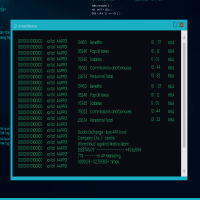
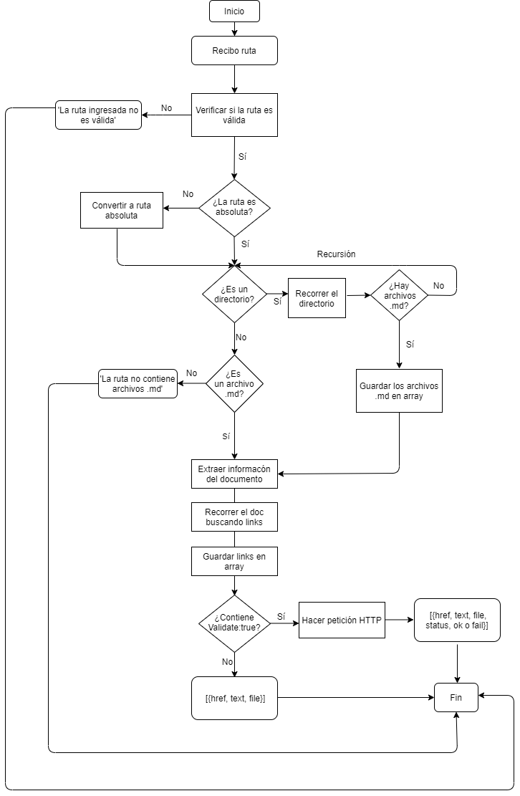
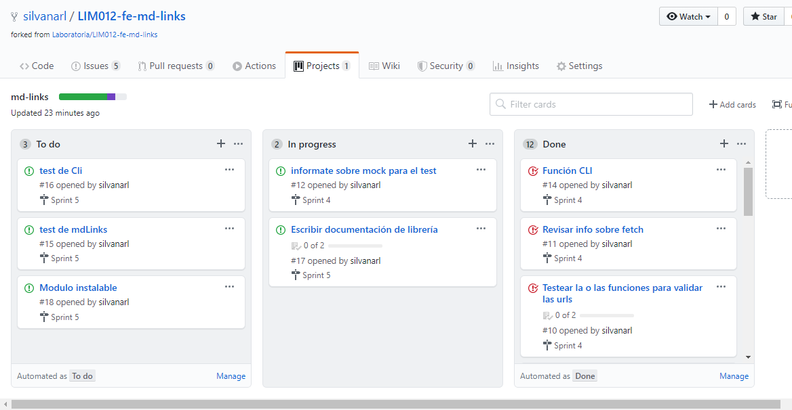
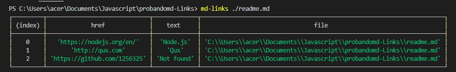
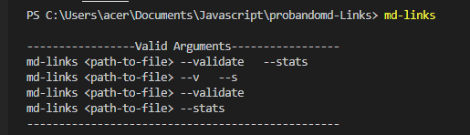
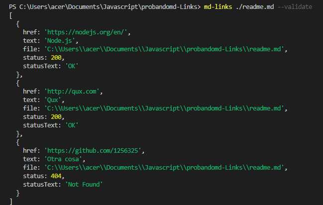
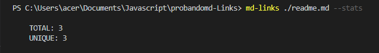
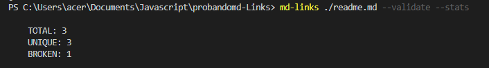

# Markdown Links


## Instalación

`npm install silvanarl/LIM012-fe-md-links`

##### Diagrama de Flujo:


##### Board en GitHub Projects:


##### Boilerplate:

```text
.
├── src
|  ├── cli.js
|  ├── main.js
|  ├── mdLinks.js
|  └── stats.js
├── test
|  ├── .eslintrc
|  ├── cli.spec.js
|  ├── main.spec.js
|  ├── stats.spec.js
|  └── mdLinks.spec.js
├── .eslintrc
├── .gitignore
├── babel.config.js
├── CODE_OF_CONDUCT.md
├── LISENCE
├── package-lock.json
├── package.json
└── README.Md

directory: 5 file: 24
```

<!-- ##### Argumentos

- `path`: Ruta absoluta o relativa al archivo o directorio. Si la ruta pasada es
  relativa, debe resolverse como relativa al directorio desde donde se invoca
  node - _current working directory_).
- `options`: Un objeto con las siguientes propiedades:
  * `validate`: Booleano que determina si se desea validar los links
    encontrados. -->

<!-- ##### Valor de retorno

La función debe retornar una promesa (`Promise`) que resuelva a un arreglo
(`Array`) de objetos (`Object`), donde cada objeto representa un link y contiene
las siguientes propiedades:

- `href`: URL encontrada.
- `text`: Texto que aparecía dentro del link (`<a>`).
- `file`: Ruta del archivo donde se encontró el link. -->

#### Ejemplo

```js
const mdLinks = require("md-links");

mdLinks("./some/example.md")
  .then(links => {
    // => [{ href, text, file }]
  })
  .catch(console.error);

mdLinks("./some/example.md", { validate: true })
  .then(links => {
    // => [{ href, text, file, status, ok }]
  })
  .catch(console.error);

mdLinks("./some/dir")
  .then(links => {
    // => [{ href, text, file }]
  })
  .catch(console.error);
```

### CLI (Command Line Interface - Interfaz de Línea de Comando)

<!-- El ejecutable de nuestra aplicación debe poder ejecutarse de la siguiente
manera a través de la terminal: -->

`md-links <path-to-file> [options]`

Por ejemplo:






#### Options

##### `--validate`

Si pasamos la opción `--validate`, el módulo debe hacer una petición HTTP para
averiguar si el link funciona o no. 

Por ejemplo:



##### `--stats`

Si pasamos la opción `--stats` el output (salida) será un texto con estadísticas
básicas sobre los links.



También podemos combinar `--stats` y `--validate` para obtener estadísticas que
necesiten de los resultados de la validación.




<!-- ## Objetivos de aprendizaje

Recuerda colocar en esta seccion los objetivos de aprendizaje que quedaron 
pendientes de tu proyecto anterior.

### Javascript
- [x] Uso de callbacks
- [x] Consumo de Promesas
- [ ] Creacion de Promesas
- [x] Modulos de Js
- [x] Recursión

### Node
- [x] Sistema de archivos
- [x] package.json
- [x] crear modules
- [x] Instalar y usar modules
- [x] npm scripts
- [x] CLI (Command Line Interface - Interfaz de Línea de Comando)

### Testing
- [x] Testeo de tus funciones
- [ ] Testeo asíncrono
- [x] Uso de librerias de Mock
- [ ] Mocks manuales
- [x] Testeo para multiples Sistemas Operativos

### Git y Github
- [x] Organización en Github

### Buenas prácticas de desarrollo
- [x] Modularización
- [x] Nomenclatura / Semántica
- [x] Linting -->
